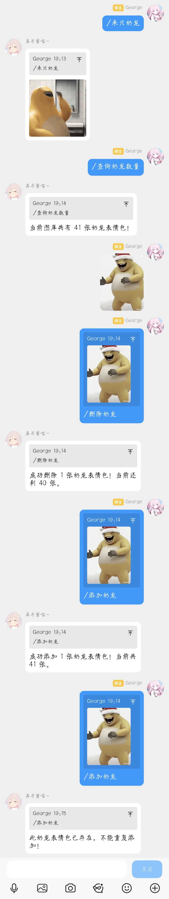

 # 🌟 来只奶龙

 <div align="center">

 

 <p align="center" style="margin-top: 8px; font-size: 18px;">
  ✨ <a href="https://github.com/AstrBotDevs/AstrBot" target="_blank">AstrBot</a> 随机发一张奶龙表情包插件 ✨
 </p>

 [](https://opensource.org/licenses/MIT)
 
 
 
 [](https://github.com/GGGeeeooorrrgggeee/astrbot_plugin_nailong)
 [](https://github.com/GGGeeeooorrrgggeee/astrbot_plugin_nailong/commits/main)

 **Language / 语言**

 [](README.md)

 </div>

---

 ## 📢 简介

 奶龙表情包是一款适配 [AstrBot](https://github.com/AstrBotDevs/AstrBot) 的趣味娱乐插件 —— 专门用于管理、发送奶龙系列表情包，发送指令即可随机调取图库表情包；管理员可附带表情包上传新增素材，也能配图自动匹配哈希删除图库内对应表情包，上传、删除功能独立可控，轻松维护专属表情包库，让机器人聊天更可爱。

 本插件完全开源免费，欢迎 Issue 和 PR。

 ## ✨ 核心功能

 | 功能 | 说明 |
 |:---|:---|
 | **随机发图** | 发送指令「来只奶龙」，从本地表情包库随机抽取一张奶龙表情包发送 |
 | **管理员上传** | 管理员发送「添加奶龙」附带表情包，自动保存表情包至素材库，批量添加无限制 |
 | **哈希删图** | 管理员发送「删除奶龙」附带表情包，自动计算表情包哈希，精准匹配并移除库内对应表情包 |
 | **图库数量查询** | 发送指令「查询奶龙数量」，所有人均可查看当前本地表情包库存总量 |
 | **独立权限管控** | 发图功能全体可用，上传、删除表情包仅管理员可操作，权限隔离 |
 | **本地轻量化存储** | 表情包以本地文件形式存储，无需向量库、大模型，占用资源极低 |
 | **素材自由扩充** | 无素材数量上限，随时新增、清理奶龙表情包，维护简单 |

 ## 📂 文件结构

 ```
 astrbot_plugin_nailong/
 ├── main.py                 # 主插件代码
 ├── metadata.yaml           # 插件元数据
 ├── logo.png                # 插件图标
 ├── init_img               # 初始表情包目录
 ```

 ## 🚀 安装和使用

 ### 安装方法

 1. 通过Astrbot的插件市场安装 / 从GitHub下载插件从文件安装 / 用 Github项目地址从链接安装
 2. 重启AstrBot服务
 3. 插件会自动初始化并加载表情包

 ### 基本使用

 #### 发送奶龙表情包
 ```
 来只奶龙
 ```
 - **权限**: 所有用户
 - **功能**: 随机发送一个奶龙表情包
 - **回复**: 如果没有表情包会提示添加新表情包

 #### 添加奶龙表情包
 ```
 添加奶龙
 ```
 - **权限**: 仅管理员
 - **功能**: 上传表情包并添加到表情包库
 - **回复**: 显示添加成功/失败的数量和去重情况
 - **特点**: 
   - 自动检测表情包格式
   - 基于MD5哈希值去重
   - 保存为 `nailong_{hash}.{ext}` 格式

 #### 删除奶龙表情包
 ```
 删除奶龙
 ```
 - **权限**: 仅管理员
 - **功能**: 删除指定回复的表情包
 - **回复**: 显示删除结果和剩余表情包数量
 - **特点**: 
   - 支持删除表情包回复
   - 支持删除普通消息中的表情包
   - 基于MD5哈希值精确匹配

#### 查询奶龙表情包的数量
 ```
 查询奶龙数量
 ```
- **权限**: 所有用户
- **功能**: 查询当前图库内奶龙表情包总数量
- **回复**: 直接返回当前表情包库存总数

 ## ⚙️ 配置说明

 ### 自动初始化
 - 插件首次启动时，会检查数据目录是否有表情包
 - 如果没有表情包，会从 `init_img/` 目录复制初始表情包
 - 初始包含35个奶龙表情包（GIF和JPG格式）

 ### 表情包存储
 - 所有表情包保存在 `plugin_data/astrbot_plugin_nailong/` 目录下
 - 表情包文件名格式：`nailong_{MD5哈希值}.{扩展名}`
 - 支持的表情包格式：JPG、PNG、GIF、BMP、WEBP、TIFF、ICO

 ### 去重机制
 - 每张表情包计算MD5哈希值（取前16位）
 - 相同哈希值的表情包不会被重复存储
 - 添加时会自动检测并跳过重复表情包

 ## 🔧 技术特性

 ### 表情包处理
 - **自动格式检测**: 根据文件头内容自动识别表情包格式
 - **智能下载**: 支持从URL下载表情包并保存到本地
 - **错误处理**: 完善的异常处理和日志记录

 ### 性能优化
 - **快速随机选择**: 使用高效的文件列表随机选择算法
 - **异步处理**: 表情包下载和处理采用异步机制
 - **内存管理**: 及时释放临时文件和内存资源

 ### 权限控制
 - **管理员验证**: 基于AstrBot内置的权限系统
 - **安全删除**: 只有管理员可以删除表情包
 - **用户反馈**: 清晰的操作结果和错误提示

 ## 📊 使用统计

 - **初始表情包数量**: 35个
 - **支持格式**: 7种（JPG、PNG、GIF、BMP、WEBP、TIFF、ICO）
 - **最大文件大小**: 不限制（建议单个表情包不超过10MB）
 - **去重机制**: MD5哈希值匹配

 ## 🚨 注意事项

 1. 确保AstrBot有足够的磁盘空间存储表情包
 2. 定期清理无用的表情包文件以节省存储空间
 3. 添加表情包时注意表情包质量和大小，避免影响发送速度
 4. 插件数据目录会被自动创建和管理，不要手动删除或修改

 ## 📞 支持与反馈

 如有问题或建议，请联系作者，作者QQ：3467842596
 - **作者**: George
 - **版本**: v1.1.0
 - **更新时间**: 2026年7月13日

## 示例图如下


---

 *补充：没搞UI界面的原因是，如果有UI界面的话，用户该自己上传表情包了，但是自己上传的表情包是无损画质的，通过“添加奶龙”指令上传的表情包是损画质的，这样就会导致两种不同方法上传的同一个表情包的MD5哈希值完全不同，导致“添加奶龙”指令时判断该奶龙表情包是否已经存在的功能就无法实现了*
