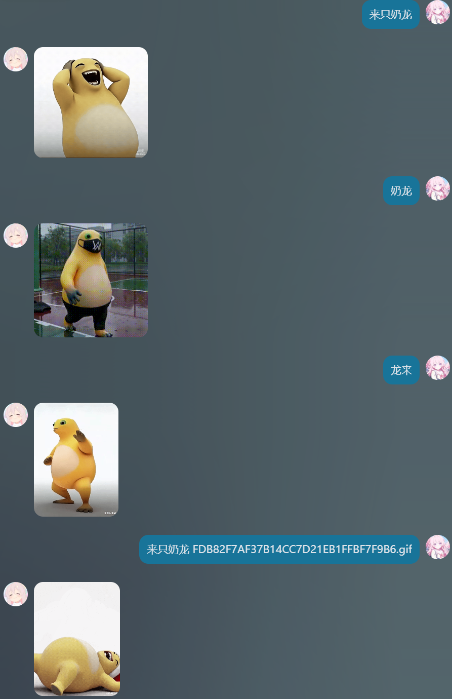
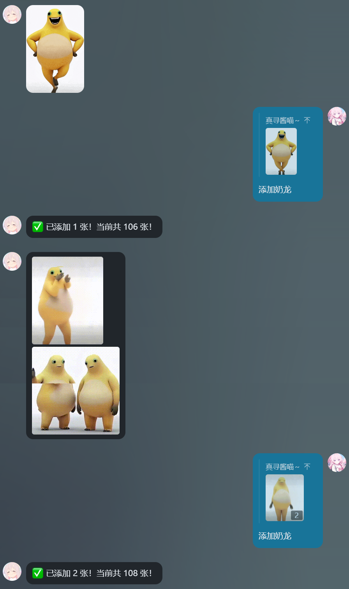

# 🐲 来只奶龙

<p align="center">
  
</p>


<p align="center" style="margin-top: 8px; font-size: 18px;">
  ✅ <a href="https://github.com/AstrBotDevs/AstrBot" target="_blank">AstrBot</a> 奶龙表情包随机发送、自动发送与插件页面管理插件 ✅
</p>


<p align="center">
  <a href="https://opensource.org/licenses/MIT"></a>
  
  
  <a href="https://github.com/GGGeeeooorrrgggeee/astrbot_plugin_nailong"></a>
  <a href="https://github.com/GGGeeeooorrrgggeee/astrbot_plugin_nailong/commits/main"></a>
</p>


<p align="center">
  <strong>Language / 语言</strong><br>
  <a href="README.md"></a>
</p>


---

## 一、简介

`来只奶龙` 是一个面向 [AstrBot](https://github.com/AstrBotDevs/AstrBot) 的奶龙表情包插件，支持通过指令随机发送奶龙表情包，也可以在检测到普通聊天时按配置概率自动发送。

插件内置一个简易管理页面，可在 AstrBot 插件页面中添加表情包、删除表情包、重命名表情包、批量导出表情包压缩包，并支持从 GitHub 仓库下载奶龙图库。表情包会存放在 AstrBot 的插件数据目录中，管理页面会自动遍历该目录下所有子文件夹中的表情包。

## 二、项目信息

- 作者：[George](https://github.com/GGGeeeooorrrgggeee)
- 版本：`1.1.0`
- 插件名：`astrbot_plugin_nailong`
- 仓库：[astrbot_plugin_nailong](https://github.com/GGGeeeooorrrgggeee/astrbot_plugin_nailong)
- 支持平台：`aiocqhttp`

## 三、核心功能

| 功能                  | 说明                                                         |
| :-------------------- | :----------------------------------------------------------- |
| 随机发送奶龙          | 使用 `来只奶龙/奶龙` 随机发送一张本地图库中的奶龙表情包，也可在后面加文件名发送指定表情包 |
| 查询奶龙数量          | 使用 `查询奶龙数量` 查看当前图库总数、GIF 数和静态图数       |
| 添加奶龙              | 通过回复表情包或消息中的表情包添加到本地图库                 |
| 删除奶龙              | 支持回复某张已存在的表情包进行删除                           |
| 自动发送奶龙          | 检测普通聊天消息，并按配置概率自动发送奶龙表情包；会自动跳过本插件指令和其他插件指令 |
| 静态图以 GIF 格式发送 | 静态图发送前可临时转成 GIF，更接近表情包样式，也可防止部分平台把静态图显示得过大 |
| 只发送 GIF 动态表情包 | 开启后，指令和自动发送都会只从 GIF 动态表情包中随机选择      |
| 插件页面管理          | 在 WebUI 中添加、删除、重命名、批量选择、批量导出表情包      |
| GitHub 图库下载       | 支持从 GitHub 仓库下载图库，可选择覆盖已存在或追加已存在     |
| GitHub 加速地址       | 插件页面内置多个加速地址，并支持测试延迟和自定义地址；默认不使用加速地址 |

## 四、文件结构

```text
astrbot_plugin_nailong/
├── main.py                    # 插件入口、指令处理、表情包管理和插件页面接口
├── _conf_schema.json          # AstrBot 插件配置项
├── metadata.yaml              # 插件元数据
├── requirements.txt           # Python 依赖
├── pages/
│   └── manager/
│       └── index.html         # 插件管理页面
├── example_images/            # README 示例图
├── logo.png                   # 插件图标
├── README.md                  # 项目说明文档
├── CHANGELOG.md               # 更新记录文档
└── LICENSE                    # 开源协议
```

## 五、依赖

```text
Pillow>=10.0.0
```

## 六、安装

1. 将 `astrbot_plugin_nailong` 文件夹放入 AstrBot 的插件目录，或通过 AstrBot 插件管理安装。
2. AstrBot 通常会自动安装 `requirements.txt` 中的依赖；如果安装失败，请根据日志手动安装。
3. 重载或重启 AstrBot。
4. 在 AstrBot WebUI 中打开插件配置，按需调整发送概率和发送格式。
5. 可以进入插件页面上传本地表情包，或通过 GitHub 图库下载按钮下载奶龙表情包。

## 七、配置说明

| 配置项                 | 默认值 | 说明                                                         |
| :--------------------- | :----- | :----------------------------------------------------------- |
| 检测聊天自动发送奶龙   | 开启   | 开启后，检测到普通聊天时会按概率自动发送一张随机奶龙表情包；会自动跳过本插件指令、其他插件已识别的指令，以及带常见命令前缀的消息 |
| 自动发送概率（百分比） | `1.0`  | 每条普通聊天触发自动发送的概率，范围为 `0` 到 `100`，默认 `1` 表示 `1%` |
| 静态图以 GIF 格式发送  | 关闭   | 开启后，抽到 png/jpg/webp 等静态图时会临时转为 GIF 后发送；抽到 GIF 动态图时仍按原 GIF 发送 |
| 只发送 GIF 动态表情包  | 关闭   | 开启后，`来只奶龙`、`奶龙` 和自动发送都会只从 GIF 动态表情包里随机选择 |

## 八、指令说明

插件指令会跟随 AstrBot 设置的命令前缀。例如 AstrBot 前缀是 `/`，则使用 `/来只奶龙`；如果前缀是 `#`，则使用 `#来只奶龙`。

### 普通指令

| 指令                | 参数         | 说明                                                         |
| :------------------ | :----------- | :----------------------------------------------------------- |
| `来只奶龙` / `奶龙` | 文件名(可选) | 随机发送一张奶龙表情包；带文件名时发送指定表情包，`奶龙` 是 `来只奶龙` 的别名 |
| `查询奶龙数量`      | 无           | 查看当前图库数量，返回格式为 `奶龙表情包共 0 张，其中GIF 0 张、静态 0 张！` |

### 管理员指令

| 指令       | 参数                       | 说明                                             |
| :--------- | :------------------------- | :----------------------------------------------- |
| `添加奶龙` | 回复表情包或消息中带表情包 | 将表情包添加到本地奶龙图库                       |
| `删除奶龙` | 回复表情包                 | 删除指定奶龙表情包；会按表情包哈希值匹配本地图库 |

## 九、插件页面

插件页面提供一个简易版奶龙图库管理器，主要包括：

| 页面功能     | 说明                                                         |
| :----------- | :----------------------------------------------------------- |
| 分类查看     | 支持 `全部`、`GIF动态表情包`、`静态表情包` 三类筛选          |
| 添加表情包   | 支持选择本地表情包上传到插件数据目录                         |
| 删除表情包   | 支持选择单张或多张表情包后批量删除                           |
| 重命名表情包 | 直接修改本地文件名，不只是修改页面显示名                     |
| 批量下载     | 将选中的表情包打包成压缩包下载到电脑                         |
| 下载图库     | 从指定 GitHub 仓库下载表情包，地址为空时默认使用官方奶龙图库 |
| 下载模式     | 支持 `下载图库（覆盖已存在）` 和 `下载图库（追加已存在）`    |
| 加速地址     | 默认不使用 GitHub 加速地址；可在插件页面下拉选择内置加速地址，也可以填写自定义加速地址 |
| 刷新提示     | 首次进入页面会静默加载图库；点击右上角 `刷新` 后才会显示 `已刷新` |

默认图库地址：

```text
https://github.com/GGGeeeooorrrgggeee/nailong-memes
```

## 十、数据目录

插件运行时会使用 AstrBot 的插件数据目录保存表情包：

```text
plugin_data/astrbot_plugin_nailong/
```

常见目录结构如下：

```text
plugin_data/astrbot_plugin_nailong/
├── gif/                  # GIF 动态表情包
├── images/               # 静态表情包
└── _hash_index.json      # 已管理表情包的哈希记录
```

说明：

1. 插件页面会自动遍历 `plugin_data/astrbot_plugin_nailong/` 下所有子文件夹中的表情包，不强制要求本地目录必须只有 `gif` 和 `images`。
2. 从默认 GitHub 图库下载时，会按仓库中的 `gif` 和 `images` 分类保存。
3. `_hash_index.json` 用于记录新添加、下载、删除、重命名表情包时的哈希信息，主要服务于添加去重和回复删除。

## 十一、注意事项

1. 如果图库为空，使用 `来只奶龙/奶龙` 会返回 `❌暂无奶龙表情包！`。
2. GitHub 图库默认直连下载，不使用加速地址；如果速度慢或失败，可以在插件页面选择加速地址并先测试延迟。
3. 管理页面会自动读取本地数据目录中的表情包；如果你手动删除了整个 `plugin_data/astrbot_plugin_nailong/` 目录，原先下载或上传的表情包也会被删除。
4. `下载图库（覆盖已存在）` 会先清空当前本地图库和哈希记录，再导入本次下载到的表情包；`下载图库（追加已存在）` 会尽量保留已有文件并追加新文件。
5. 自动发送会过滤指令消息；如果其他插件使用完全无前缀的自然语言指令，且 AstrBot 没有把它标记为已识别指令，仍可能被当作普通聊天参与概率判断。

## 十二、现存 Bug

以下问题属于当前逻辑限制，暂无较好的优化方法：

1. `添加奶龙` 的去重依赖表情包文件哈希值判断。若同一个表情包同时存在静态图版本和 GIF 动态图版本，因为文件内容不同，哈希值也不同，插件不会把它们识别成同一张表情包。同一个表情包如果像素尺寸、压缩方式、裁剪范围、颜色等文件内容有变化，哈希值也会不同，同样可能无法识别为重复表情包，需要用户自行判断是否重复添加。
2. `默认图库` 里有一个 `GIF` 表情包 `F1520BD8CD600B54D8F6CDE1791DEF0F.gif` 大小为 `11.9 MB`，有点大，所以在插件页面加载不出来。

## 十三、示例图

### 来只奶龙/奶龙：



### 查询奶龙数量：


### 添加奶龙：



### 删除奶龙：


